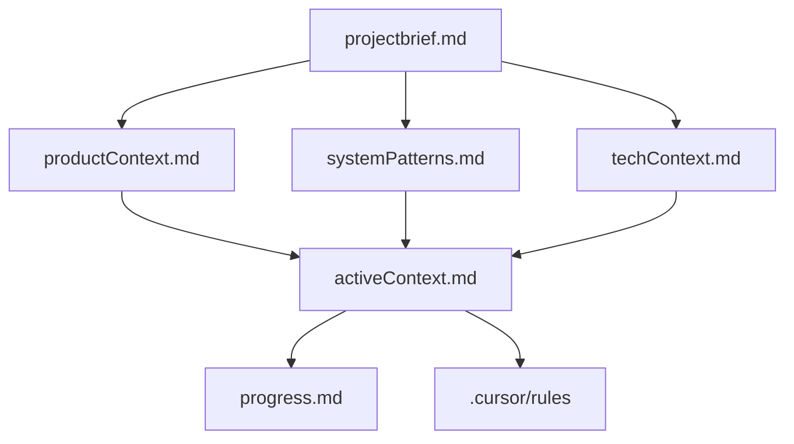

# Memory Bank - LiveCodingApp

## Overview
The Memory Bank is a comprehensive documentation system that captures the complete context and knowledge about the LiveCodingApp project. It serves as the single source of truth for understanding the project's architecture, current state, and development direction.

## Purpose
After any memory reset, this Memory Bank provides complete context to continue development effectively. It eliminates the need to re-analyze the codebase and ensures consistent understanding across development sessions.

## Structure

### Core Files (Required)
1. **[projectbrief.md](projectbrief.md)** - Foundation document defining core requirements and goals
2. **[productContext.md](productContext.md)** - Why this project exists and how it should work
3. **[systemPatterns.md](systemPatterns.md)** - System architecture and design patterns
4. **[techContext.md](techContext.md)** - Technologies, development setup, and constraints
5. **[activeContext.md](activeContext.md)** - Current work focus and next steps
6. **[progress.md](progress.md)** - What works, what's left, and current status

### Additional Context
- **[.cursor/rules/livecodingapp.mdc](../.cursor/rules/livecodingapp.mdc)** - Project intelligence and patterns

## How to Use

### For New Developers
1. Start with `projectbrief.md` to understand the project scope
2. Read `productContext.md` to understand user experience goals
3. Review `systemPatterns.md` for architecture understanding
4. Check `techContext.md` for development setup
5. Read `activeContext.md` for current priorities
6. Review `progress.md` for implementation status

### For Returning Developers
1. Check `activeContext.md` for recent changes and next steps
2. Review `progress.md` for current status and known issues
3. Update relevant documents after significant changes

### For Project Updates
1. Update `activeContext.md` with recent work and decisions
2. Modify `progress.md` to reflect completed features
3. Update `.cursor/rules` with new patterns discovered
4. Revise other documents as architecture evolves

## File Relationships

## Maintenance

### When to Update
- After implementing significant features
- When architecture decisions change
- After discovering new patterns or issues
- When user requirements evolve
- After completing major milestones

### Update Process
1. **Review ALL files** to ensure consistency
2. **Update activeContext.md** with recent changes
3. **Modify progress.md** to reflect current status
4. **Revise relevant documents** as needed
5. **Update .cursor/rules** with new insights

### Quality Checks
- Ensure all documents reference each other appropriately
- Verify that current state matches documented state
- Check that next steps are clearly defined
- Confirm that known issues are accurately documented

## Benefits

### For Development
- **Quick Onboarding**: New developers understand the project immediately
- **Context Preservation**: No knowledge loss between sessions
- **Decision Tracking**: Architecture decisions are documented and justified
- **Progress Visibility**: Clear view of what's accomplished and what's next

### For Maintenance
- **Consistent Understanding**: All team members share the same context
- **Efficient Debugging**: Known issues and solutions are documented
- **Pattern Recognition**: Common solutions are captured and reused
- **Quality Assurance**: Clear criteria for what constitutes "done"

### For Planning
- **Feature Prioritization**: Clear understanding of current state
- **Risk Assessment**: Known issues and challenges are documented
- **Resource Planning**: Effort estimates based on documented requirements
- **Timeline Management**: Progress tracking against defined milestones

## Best Practices

### Documentation Standards
- Use clear, concise language
- Include code examples where relevant
- Maintain consistent formatting and structure
- Link related concepts across documents
- Update documents before they become outdated

### Content Guidelines
- Focus on "why" not just "what"
- Document decisions and their rationale
- Include both current state and future vision
- Capture lessons learned and best practices
- Maintain actionable next steps

### Review Process
- Review documents after each major change
- Validate accuracy against current codebase
- Ensure consistency across all documents
- Update outdated information promptly
- Solicit feedback from team members

This Memory Bank is the foundation for effective development and maintenance of the LiveCodingApp project. Keep it current, comprehensive, and accessible to all team members.
